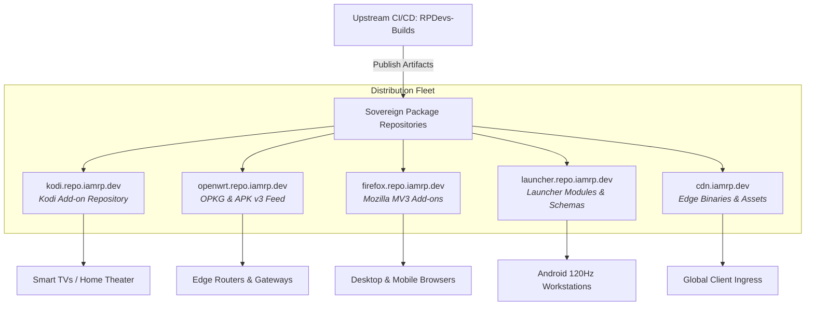

# Sovereign Package Distribution Hub
## **Central Ingress & Universal Package Index for the RPDev Ecosystem**

> [!abstract] Architectural Mission
> The **RPDev Repository Hub** (`repo.iamrp.dev`) provides an authoritative single pane of glass across all sovereign software distribution channels. When upstream projects in `RPDevs-Builds` publish new release tags or build artifacts, automated CI/CD pipelines compile, sign, checksum, and stage packages directly into their specialized sub-repositories.



---

## 📦 Sovereign Distribution Repositories

| Ecosystem | Subdomain / Portal | Target Format | Primary Artifacts | Status |
| :--- | :--- | :---: | :--- | :---: |
| **[[kodi|Kodi Add-ons]]** | **[`kodi.repo.iamrp.dev`](https://kodi.repo.iamrp.dev/)** | `.zip` | `addons.xml`, `addons.xml.md5`, `repository.rpdevs-*.zip` | **Active** |
| **[[openwrt|OpenWrt Custom Feed]]** | **[`openwrt.repo.iamrp.dev`](https://openwrt.repo.iamrp.dev/)** | `.ipk` / `.apk` | `Packages.gz` (OPKG), `APKINDEX.tar.gz` (APK v3), `luci-app-nfs` | **Active** |
| **[[firefox|Firefox Privacy Add-ons]]** | **[`firefox.repo.iamrp.dev`](https://firefox.repo.iamrp.dev/)** | `.xpi` | `updates.json`, DNS Forge, SHA-256 binary manifests | **Active** |
| **[[launcher|RPDev Launcher Registry]]** | **[`launcher.repo.iamrp.dev`](https://launcher.repo.iamrp.dev/)** | `.json` / `.apk` | `modules.json`, Hub Card JSON Schemas, APK releases | **Active** |
| **[[cdn|Edge Delivery Gateway]]** | **[`cdn.iamrp.dev`](https://cdn.iamrp.dev/)** | Static Assets | JetBrains Mono fonts, security policies, raw assets | **Active** |

---

## ⚡ Quick Integration Terminal Guide

### 1. OpenWrt Routers (Wire-Speed Storage & Management)
```bash
# OPKG Feed (OpenWrt 23.05 and earlier)
echo 'src/gz rpdev_all https://openwrt.repo.iamrp.dev/packages/all' >> /etc/opkg/customfeeds.conf
opkg update && opkg install luci-app-nfs

# Alpine APK v3 Feed (OpenWrt 24.10+)
echo 'https://openwrt.repo.iamrp.dev/packages/all' >> /etc/apk/repositories.d/rpdev.list
apk update && apk add luci-app-nfs
```

### 2. Kodi Media Center (Omega v21 & Piers v22)
1. In Kodi, navigate to **Settings** → **File Manager** → **Add source**.
2. Enter source URL: `https://kodi.repo.iamrp.dev/` and name it `RPDev Repo`.
3. Return to **Add-ons** → **Install from zip file** → select `RPDev Repo` → install `repository.rpdevs-1.0.0.zip`.

### 3. Firefox Privacy Extension (DNS Forge)
1. Visit **[`https://firefox.repo.iamrp.dev/`](https://firefox.repo.iamrp.dev/)**.
2. Click **Install DNS Forge Extension** to load the signed `.xpi` package into Firefox.
3. Automatic updates are governed by `https://firefox.repo.iamrp.dev/updates.json`.

---

## 🔒 Cryptographic Integrity & Automated Ingestion

All packages hosted within the RPDev distribution fleet adhere to zero-trust packaging principles:
1. **Source Verifiable**: Every package is compiled exclusively by automated GitHub Actions workflows from pinned source commits.
2. **Deterministic Manifests**: Package feeds generate authenticated indices (`addons.xml.md5`, `Packages.gz`, `APKINDEX.tar.gz`, `updates.json`) during every build step.
3. **Immutability**: Re-releases require version bumps; existing artifacts are checksummed with SHA-256 before ingestion.
